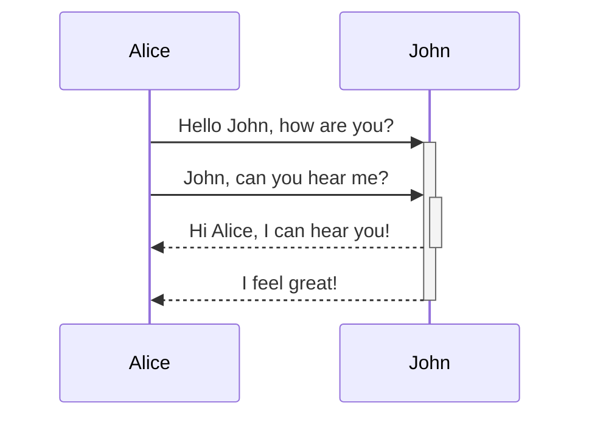

CSS Snippet for diagram sizing.  Enter Mermaid diagram inside a grid tag.
```html
<grid drag="50 50" drop="0 15" bg="transparent" style="border-radius:15px">


---
themeVariables:
    fontSize: 32px
theme: beige
highlightTheme: css/vs2015.css
---



````md
---
theme: beige
highlightTheme: css/vs2015.css
---

```mermaid
    gitGraph
       commit
       commit
       branch develop
       checkout develop
       commit
       commit
       checkout main
       merge develop
       commit
       commit
    ```
````

